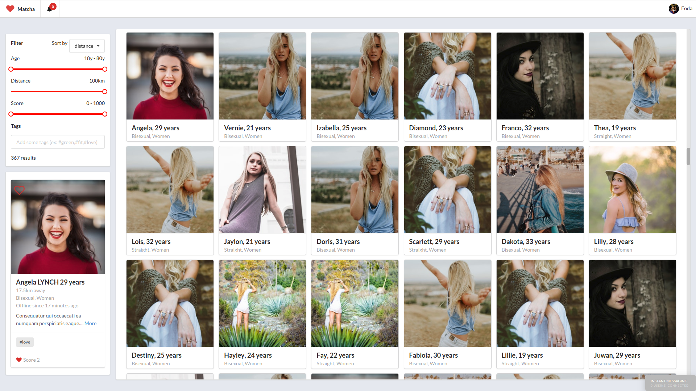
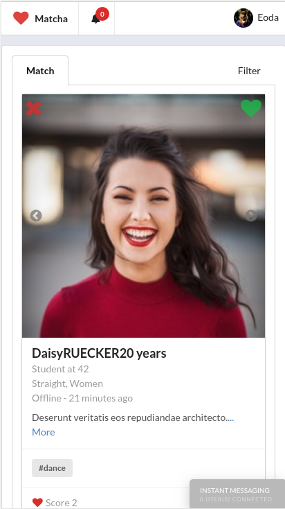

# Matcha

Matcha is a dating website.

### How to use it in local ?

1. Clone the project
2. Create a mysql database called `matcha`
3. Create a `.env` file in `matcha` with those properties

```
HOST=localhost
DB_USER=
DB_PASS=
PORT=8082
JWT_KEY=S3cr3tTok3nAcc3ss
SMTP_MAIL_AUTH=
SMTP_MAIL_PASS=
API_KEY_OPENCAGE=
CLIENT_ID=
CLIENT_SECRET=
```

4. Create a `.env` file in `matcha/front-end/` with those properties

```
API_KEY_OPENCAGE=
REACT_APP_CLIENT_ID=
REACT_APP_CLIENT_SECRET=
```

5. Where can I find out my API keys
[SMTP](https://mailtrap.io),
[OPENCAGE](https://opencagedata.com/),
[42_CLIENT](https://api.intra.42.fr) Only available for 42 Student (OPTIONAL)

6. Then run this command into `matcha` and `matcha/front-end` to install packages and dependencies from package.json

```
npm -i 
```

7. Run the server-side (matcha/)

```
npm start
```

8. Create the tables of database

```
curl http://localhost:8082/api
```

9. Populate the database, with a seed generator between 500 and 1000 new persons  

```
node seedgen.js GIVE_A_NUMBER_BETWEEN_500_AND_1000
```

10. Run `npm start` into `matcha/front-end/`

### Running

Create an account, and check your email on [mailtrap](https://mailtrap.io) to activate it.
You can now sign-in, you have to fill some field yet and then you can match, talk, date and do even more ...

### Some views




### Our stack

	* React / React-router / Redux
	* Node.js / Express
	* JavaScript ES6+
	* MYSQL
	* SCSS
 	* OAuth
	* Socket.io

### Project’s constraints

	Mandatory tools: 
		* Relational database 

	Forbidden tools:
		* ORM/ODM
		* MVC framework
		* Registration / Authentication library

### Resource
[Faker](https://unsplash.com/developers)
[Geocoding](https://developers.google.com/maps/solutions/store-locator/clothing-store-locator#finding-locations-with-mysql)

### Author

Written by [bsiguret](https://github.com/bsiguret) and myself.

